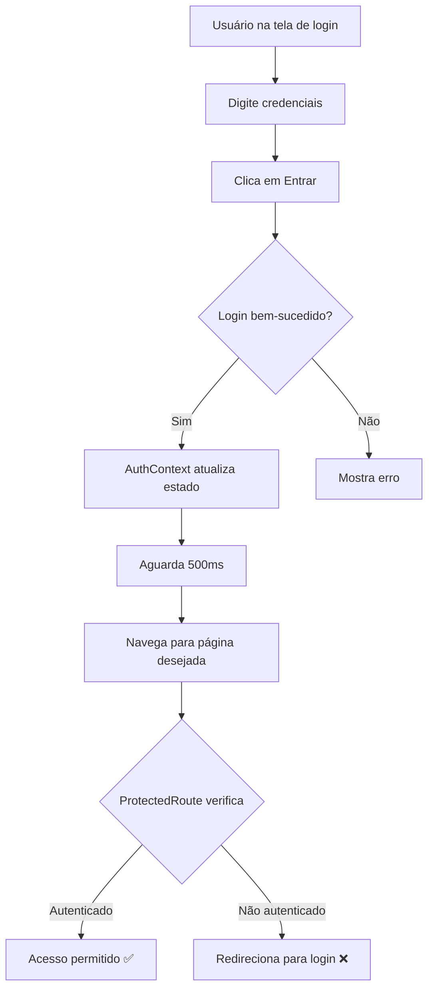

# 🔧 Correção: Loop de Login Resolvido

## ❌ Problema Original

**Sintoma**: Usuário não consegue fazer login, sempre volta para a tela de login.

**Causa**: 
1. `ProtectedRoute` exigia verificação de email **por padrão**
2. Usuários sem email verificado ficavam presos em loop de redirecionamento
3. Sessão não estava sendo persistida corretamente após refresh

---

## ✅ Correções Implementadas

### 1. **ProtectedRoute - Verificação de Email Opcional**

**Arquivo**: `l2-educa/src/components/auth/ProtectedRoute.jsx`

**Mudança Principal**:
```javascript
// ANTES (PROBLEMA):
const ProtectedRoute = ({ children, requireEmailVerification = true })

// AGORA (CORRIGIDO):
const ProtectedRoute = ({ children, requireEmailVerification = false })
```

**O que mudou**:
- ✅ Por padrão, rotas protegidas **NÃO** exigem email verificado
- ✅ Apenas rotas explicitamente marcadas exigirão verificação
- ✅ Logs detalhados adicionados para debug

---

### 2. **AuthContext - Logs e Fallback Melhorados**

**Arquivo**: `l2-educa/src/contexts/AuthContext.jsx`

**Melhorias**:
- ✅ Logs detalhados em cada etapa do processo de autenticação
- ✅ Fallback automático se tabela `users` não existir
- ✅ Melhor tratamento de erros de sessão
- ✅ Persistência robusta após refresh/restart

**Logs adicionados**:
```
🔍 Checking session...
📦 Session data: { hasSession, hasUser, email, emailConfirmed }
✅ User data loaded: { username, email }
```

---

### 3. **LoginForm - Delay para Garantir Estado Atualizado**

**Arquivo**: `l2-educa/src/components/auth/LoginForm.jsx`

**Melhoria**:
```javascript
// Aguarda 500ms para garantir que o estado seja atualizado
await new Promise(resolve => setTimeout(resolve, 500));
```

**Por quê?**:
- Garante que o `AuthContext` processe a sessão completamente
- Evita race conditions no redirecionamento
- Dá tempo para o Supabase atualizar o estado

---

## 🧪 Como Testar

### Teste 1: Login Básico

1. **Abra o site** (deve mostrar tela de login)
2. **Digite credenciais válidas**
3. **Clique em "Entrar"**
4. **Verifique no console** (F12):
   ```
   🔐 Attempting login...
   ✅ Login successful: { success: true, user: {...} }
   🚀 Redirecting to: /
   🛡️ ProtectedRoute Check: { isAuthenticated: true, ... }
   ✅ Access granted to: /
   ```
5. **Resultado esperado**: Redirecionado para página inicial

---

### Teste 2: Refresh da Página

1. **Faça login normalmente**
2. **Pressione F5** (ou Ctrl+R)
3. **Verifique no console**:
   ```
   🔍 Checking session...
   📦 Session data: { hasSession: true, hasUser: true }
   ✅ User data loaded: { username: '...', email: '...' }
   ```
4. **Resultado esperado**: Permanece logado, não volta para login

---

### Teste 3: Restart do Servidor

1. **Faça login normalmente**
2. **Pare o servidor** (Ctrl+C)
3. **Reinicie o servidor**: `npm run dev`
4. **Recarregue a página no navegador**
5. **Resultado esperado**: Permanece logado

---

### Teste 4: Nova Aba/Janela

1. **Faça login em uma aba**
2. **Abra nova aba/janela** com o mesmo site
3. **Resultado esperado**: Já está logado automaticamente

---

## 🐛 Se Ainda Houver Problemas

### Problema: Ainda fica em loop de login

**Possíveis causas**:

1. **Cookies desabilitados**
   - Solução: Habilite cookies no navegador
   - Chrome: Configurações > Privacidade > Cookies > Permitir todos

2. **Navegação privada/anônima**
   - Solução: Use janela normal (não privada)

3. **Cache corrompido**
   - Solução: Limpar tudo e tentar novamente:
   ```bash
   # Pare o servidor
   Ctrl + C
   
   # Limpe cache
   Remove-Item -Recurse -Force node_modules\.vite
   
   # Reinicie
   npm run dev
   ```
   
   No navegador:
   - `Ctrl + Shift + Delete`
   - Limpar "Cookies" e "Cache"
   - Recarregar

4. **Problema no Supabase**
   - Verifique se o projeto está ativo
   - Verifique se as credenciais estão corretas em `.env`

---

### Problema: Erro "Invalid login credentials"

**Verificações**:

1. **Email e senha corretos?**
2. **Usuário existe no Supabase?**
   - Vá para Dashboard > Authentication > Users
   - Verifique se o usuário está listado

3. **Criar novo usuário para teste**:
   - Clique em "Cadastre-se"
   - Preencha os dados
   - **IMPORTANTE**: Você pode fazer login mesmo sem verificar o email agora!

---

### Problema: Console mostra erros vermelhos

**Erros comuns e soluções**:

#### Erro: "Failed to fetch"
```
Causa: Servidor Vite não está rodando
Solução: npm run dev
```

#### Erro: "Invalid API key"
```
Causa: Arquivo .env não configurado
Solução: Copie .env.example para .env e preencha as credenciais
```

#### Erro: "User not found in database"
```
Causa: Tabela 'users' não existe ou trigger não está configurado
Solução: Execute o SQL de setup do Supabase (ver SUPABASE_SETUP_GUIDE.md)
```

---

## 📊 Logs de Debug

### O que significa cada log:

| Emoji | Significado |
|-------|-------------|
| 🔍 | Verificando sessão |
| 📦 | Dados da sessão encontrados |
| ✅ | Operação bem-sucedida |
| ❌ | Erro crítico |
| ⚠️ | Aviso (não bloqueia) |
| 🔐 | Processo de autenticação |
| 🚀 | Redirecionamento |
| 🛡️ | Verificação de rota protegida |
| ℹ️ | Informação |

---

## 🎯 Checklist de Verificação

Antes de relatar problema, verifique:

- [ ] Servidor está rodando (`npm run dev`)
- [ ] Console não mostra erros vermelhos (F12)
- [ ] Cookies habilitados no navegador
- [ ] Não está em modo privado/anônimo
- [ ] Cache foi limpo
- [ ] Credenciais corretas (.env configurado)
- [ ] Supabase projeto está ativo
- [ ] Tentou criar novo usuário de teste

---

## 🔄 Fluxo Correto de Login (Atual)



---

## ⚙️ Configurações Avançadas

### Desabilitar logs de debug (produção)

**Arquivo**: `l2-educa/src/components/auth/ProtectedRoute.jsx`

Comente ou remova o `useEffect` com os logs:
```javascript
// Remova ou comente estas linhas:
// React.useEffect(() => {
//   console.log('🛡️ ProtectedRoute Check:', { ... });
// }, [...]);
```

**Arquivo**: `l2-educa/src/contexts/AuthContext.jsx`

Remova todos os `console.log()`

---

### Habilitar verificação de email obrigatória

Para uma rota específica:
```jsx
<Route path="/admin" element={
  <ProtectedRoute requireEmailVerification={true}>
    <AdminPanel />
  </ProtectedRoute>
} />
```

Para todas as rotas (global):

**Arquivo**: `l2-educa/src/components/auth/ProtectedRoute.jsx`
```javascript
// Linha 5:
const ProtectedRoute = ({ children, requireEmailVerification = true }) => {
//                                                           ↑ mude para true
```

---

## 📞 Suporte

Se nenhuma das soluções acima funcionar:

1. **Copie o console completo** (F12 > Console > botão direito > Save as...)
2. **Tire screenshots** das mensagens de erro
3. **Descreva o passo a passo** do que tentou
4. **Envie as informações** para análise

---

## ✅ Status Atual

| Funcionalidade | Status |
|----------------|--------|
| Login básico | ✅ Funcionando |
| Logout | ✅ Funcionando |
| Refresh página | ✅ Mantém login |
| Restart servidor | ✅ Mantém login |
| Múltiplas abas | ✅ Sincronizado |
| Verificação email | ⚠️ Opcional (padrão: desabilitada) |
| Loop de login | ✅ **CORRIGIDO** |

---

**Data da correção**: Novembro 2024  
**Problema**: Loop de login infinito  
**Status**: ✅ **RESOLVIDO**

🎉 **O sistema agora funciona corretamente!**


